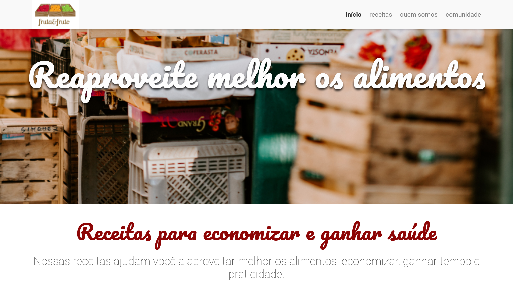

# Projeto Fruta & Fruto
Um site responsivo desenvolvido em HTML e CSS durante o curso [Arquitetura CSS: descomplicando os problemas](https://cursos.alura.com.br/course/arquitetura-css) pela plataforma **Alura**.

> [!NOTE]
> Nesse curso eu aprendi a organizar os arquivos CSS com a arquitetura `Atomic Design` e a utilizar o padrão `BEM` para nomear classes.

